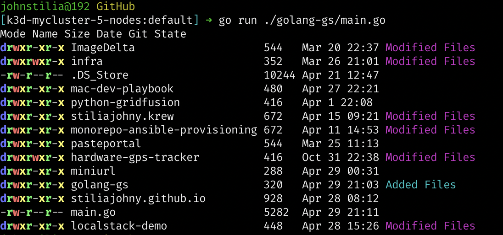

[![Contributors][contributors-shield]][contributors-url]
[![Forks][forks-shield]][forks-url]
[![Stargazers][stars-shield]][stars-url]
[![Issues][issues-shield]][issues-url]
[![GPL3 License][license-shield]][license-url]
[![LinkedIn][linkedin-shield]][linkedin-url]
[![Ask Me Anything][ask-me-anything]][personal-page]

<!-- PROJECT LOGO -->
<br />
<p align="center">
  <a href="https://github.com/non-existing-organization/golang-gs">
    
  </a>

  <h3 align="center">golang-gs</h3>

  <p align="center">
    Get a quick overview of your Git repositories with gs, the cross-platform alternative to ls.
    <br />
    <a href="./README.md"><strong>Explore the docs »</strong></a>
    <br />
    <br />
    <a href="https://github.com/non-existing-organization/golang-gs/issues/new?labels=i%3A+bug&template=1-bug-report.md">Report Bug</a>
    ·
    <a href="https://github.com/non-existing-organization/golang-gs/issues/new?labels=i%3A+enhancement&template=2-feature-request.md">Request Feature</a>
  </p>
</p>

<!-- TABLE OF CONTENTS -->

## Table of Contents

- [Table of Contents](#table-of-contents)
- [About The Project](#about-the-project)
  - [Built With](#built-with)
- [Getting Started](#getting-started)
  - [Prerequisites](#prerequisites)
  - [Installation](#installation)
- [Usage](#usage)
- [Roadmap](#roadmap)
- [Contributing](#contributing)
- [License](#license)
- [Contact](#contact)
- [Acknowledgements](#acknowledgements)

<!-- ABOUT THE PROJECT -->

## About The Project



The "gs" tool is a modified version of the traditional "ls" command in Unix-like operating systems. The primary goal of this tool is to provide a better overview of the contents of a directory, including the state of any Git repositories contained within. The idea for the tool came from the frustration of manually checking the state of Git repositories in each folder. This tool was created to simplify this process and make it more efficient. Instead of having to manually navigate to each Git repository, the "gs" tool provides a centralized and streamlined way to view the state of all Git repositories in a directory. With colorful and easy-to-read output, the "gs" tool is a must-have for any developer who regularly uses Git for version control.

### Built With

- Go

## Getting Started

These instructions will get you a copy of the project up and running on your local machine for development and testing purposes.

### Prerequisites

Before you begin, make sure you have Go installed on your machine. You can check if you have Go installed by running the following command in your terminal:

```go
go version
```

If Go is not installed, you can install it from the official website: https://golang.org/dl/

### Installation

To install the gs tool, follow these steps:

- Clone the repository to your local machine:

  ```bash
  https://github.com/non-existing-organization/golang-gs.git
  ```

- Change into the project directory:

  ```bash
  cd golang-gs
  ```

- Build the project:
  ```go
  go build
  ```

The gs executable file will be generated in the project directory. You can now run the tool using the following command:

```bash
./gs
```

## Usage

The gs tool can be used just like the ls command in your terminal. It will list the contents of the current directory and show the file mode, name, size, date, and Git state if the file is a Git repository.

To run the tool, simply type the following command in your terminal:

```
gs
```

The output will display the information for each file and directory in the current directory.

<!-- ROADMAP -->

## Roadmap

See the [open issues](https://github.com/non-existing-organization/golang-gs/issues) for a list of proposed features (and known issues).

---

<!-- CONTRIBUTING -->

## Contributing

Contributions are what make the open source community such an amazing place to be learn, inspire, and create. Any contributions you make are **greatly appreciated**.

1. Fork the Project
2. Create your Feature Branch (`git checkout -b feature/AmazingFeature`)
3. Commit your Changes (`git commit -m 'Add some AmazingFeature'`)
4. Push to the Branch (`git push origin feature/AmazingFeature`)
5. Open a Pull Request

---

<!-- LICENSE -->

## License

Distributed under the GPLv3 License. See `LICENSE` for more information.

<!-- CONTACT -->

## Contact

John Stilia - stilia.johny@gmail.com

<!--
Project Link: [https://github.com/your_username/repo_name](https://github.com/your_username/repo_name)
-->

---

<!-- ACKNOWLEDGEMENTS -->

## Acknowledgements

- [GitHub Emoji Cheat Sheet](https://www.webpagefx.com/tools/emoji-cheat-sheet)
- [Img Shields](https://shields.io)
- [Choose an Open Source License](https://choosealicense.com)
- [GitHub Pages](https://pages.github.com)

<!-- MARKDOWN LINKS & IMAGES -->
<!-- https://www.markdownguide.org/basic-syntax/#reference-style-links -->

[contributors-shield]: https://img.shields.io/github/contributors/non-existing-organization/golang-gs.svg?style=for-the-badge
[contributors-url]: https://github.com/non-existing-organization/golang-gs/graphs/contributors
[forks-shield]: https://img.shields.io/github/forks/non-existing-organization/golang-gs.svg?style=for-the-badge
[forks-url]: https://github.com/non-existing-organization/golang-gs/network/members
[stars-shield]: https://img.shields.io/github/stars/non-existing-organization/golang-gs.svg?style=for-the-badge
[stars-url]: https://github.com/non-existing-organization/golang-gs/stargazers
[issues-shield]: https://img.shields.io/github/issues/non-existing-organization/golang-gs.svg?style=for-the-badge
[issues-url]: https://github.com/non-existing-organization/golang-gs/issues
[license-shield]: https://img.shields.io/github/license/non-existing-organization/golang-gs?style=for-the-badge
[license-url]: https://github.com/non-existing-organization/golang-gs/blob/master/LICENSE.txt
[linkedin-shield]: https://img.shields.io/badge/-LinkedIn-black.svg?style=for-the-badge&logo=linkedin&colorB=555
[linkedin-url]: https://linkedin.com/in/johnstilia/
[product-screenshot]: .assets/screenshot.png
[ask-me-anything]: https://img.shields.io/badge/Ask%20me-anything-1abc9c.svg?style=for-the-badge
[personal-page]: https://github.com/non-existing-organization
